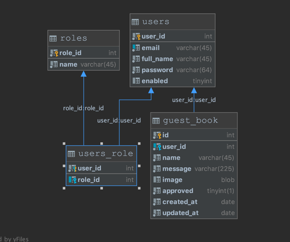

Install Mysql:
Start Mysql server by using the following command: mysql.server start

execute following Mysql queries:
Steps:
create database guestbook;

CREATE TABLE `users` (
`user_id` INT NOT NULL AUTO_INCREMENT,
`email` varchar(45) NOT NULL,
`full_name` varchar(45) NOT NULL,
`password` varchar(64) NOT NULL,
`enabled` tinyint(4) DEFAULT NULL,
PRIMARY KEY (`user_id`),
UNIQUE KEY `email_UNIQUE` (`email`)
);

CREATE TABLE `roles` (
`role_id` int(11) NOT NULL AUTO_INCREMENT,
`name` varchar(45) NOT NULL,
PRIMARY KEY (`role_id`)
);

CREATE TABLE `users_role` (
`user_id` INT NOT NULL,
`role_id` INT(11) NULL,
PRIMARY KEY (`user_id`)
);

ALTER TABLE `users_role` ADD INDEX `role_fk_idx`(`role_id` ASC);
ALTER TABLE `users_role` ADD CONSTRAINT `user_fk`  FOREIGN KEY (`user_id`)
REFERENCES `users` (`user_id`) ON DELETE NO ACTION ON UPDATE NO ACTION,
ADD CONSTRAINT `role_fk`  FOREIGN KEY (`role_id`)
REFERENCES `roles` (`role_id`) ON DELETE NO ACTION ON UPDATE NO ACTION;

INSERT INTO `roles` (`name`) VALUES ('GUEST');
INSERT INTO `roles` (`name`) VALUES ('ADMIN');

INSERT INTO `users` (`email`, `full_name`, `password`, `enabled`) VALUES ('rajesh@test.com', 'RajeshG', '$2a$10$kOpEw2IUBkABbWHBpQFYQ.46hB5xlFpMTU27oUgTJC5Mro9hNLc4G', '1');
INSERT INTO `users` (`email`, `full_name`, `password`, `enabled`) VALUES ('admin@test', 'Administrator', '$2a$10$GqxPaVWOfZkUMfHz7Zz66.uc02vvFZIe2nVqexM11cFRnIrzioIf6', '1');

INSERT INTO `users_role` (`user_id`, `role_id`) VALUES (1, 1);
INSERT INTO `users_role` (`user_id`, `role_id`) VALUES (2, 2);

create table guest_book
(
id int auto_increment,
user_id int not null,
name varchar(45) not null,
message varchar(225) not null,
image blob null,
approved boolean default false not null,
created_at date not null,
updated_at date not null,
constraint guest_book_pk
primary key (id)
);

ALTER TABLE `guest_book` ADD INDEX `guest_fk_idx`(`user_id` ASC);
ALTER TABLE `guest_book` ADD CONSTRAINT `user_fk`  FOREIGN KEY (`user_id`)
REFERENCES `users` (`user_id`) ON DELETE NO ACTION ON UPDATE NO ACTION;

Roles:
GUEST, ADMIN

DB schema

To start application follow below commands, make sure all the above commands executed.
mvn clean install
java -jar guestbook-0.0.1-SNAPSHOT.jar

open url in a browser:
localhost:8080
Guest:
username: rajesh@test.com
password: RajeshG

Admin:
username: admin@test
password: Administrator

